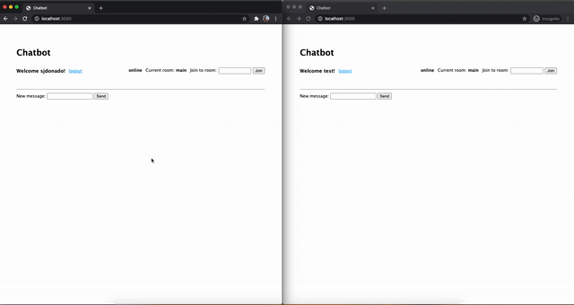

# RabbitMQ chatbot

<div align="center">
  
</div>


## Requeriments
- Docker

## Dummy prod
- Run `sh prod-setup.sh`
- Go to http://localhost:3000 and login it with a dummy user:
```json
[
  { "username": "sjdonado", "password": "12345" },
  { "username": "test", "password": "12345" }
]
```
- Run tests
```bash
docker-compose -f docker-compose.prod.yml run --rm app_prod npm test
```

## Development setup
- Docker setup
Run `docker-compose build`

- RabbitMQ setup
Run `sh rabbitmq-setup.sh`

- Run all
```
docker-compose up
```
**Expected output:**
```bash
rabbitmq_1  | 2020-10-26 13:45:02.818 [info] <0.541.0> Ready to start client connection listeners
rabbitmq_1  | 2020-10-26 13:45:02.818 [info] <0.44.0> Application rabbitmq_prometheus started on node rabbit@460d787cc2c0
rabbitmq_1  | 2020-10-26 13:45:02.821 [info] <0.691.0> started TCP listener on [::]:5672
app_1       | [amqp]::reconnecting: attempts 2/5
rabbitmq_1  | 2020-10-26 13:45:02.905 [info] <0.694.0> accepting AMQP connection <0.694.0> (192.168.208.5:59928 -> 192.168.208.2:5672)
rabbitmq_1  | 2020-10-26 13:45:02.963 [info] <0.694.0> connection <0.694.0> (192.168.208.5:59928 -> 192.168.208.2:5672): user 'sjdonado' authenticated and granted access to vhost 'chatbot'
app_1       | [amqp]::connected
rabbitmq_1  | 2020-10-26 13:45:03.250 [info] <0.541.0> Server startup complete; 3 plugins started.
rabbitmq_1  |  * rabbitmq_prometheus
rabbitmq_1  |  * rabbitmq_web_dispatch
rabbitmq_1  |  * rabbitmq_management_agent
rabbitmq_1  |  completed with 3 plugins.
rabbitmq_1  | 2020-10-26 13:45:03.251 [info] <0.541.0> Resetting node maintenance status
bot_1       | [amqp]::reconnecting: attempts 3/5
rabbitmq_1  | 2020-10-26 13:45:03.609 [info] <0.706.0> accepting AMQP connection <0.706.0> (192.168.208.4:49822 -> 192.168.208.2:5672)
rabbitmq_1  | 2020-10-26 13:45:03.667 [info] <0.706.0> connection <0.706.0> (192.168.208.4:49822 -> 192.168.208.2:5672): user 'bot' authenticated and granted access to vhost 'chatbot'
bot_1       | [amqp]::connected
```

- Create an user
```bash
curl --header "Content-Type: application/json" --request POST --data '{"username":"test_1","password":"12345"}' http://localhost:3000/users
```

- Run tests
```bash
docker-compose run --rm app yarn test
```